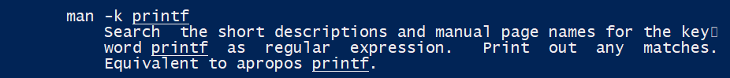
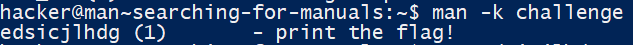
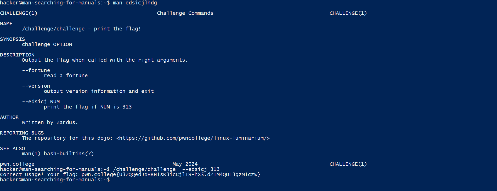
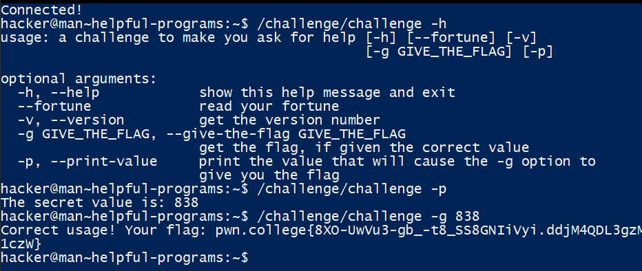
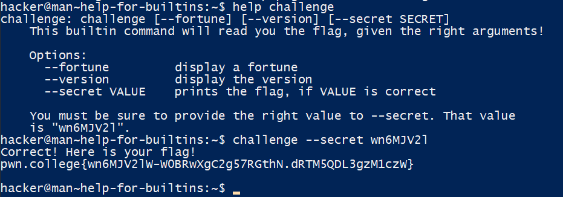

# Digesting Documentation
### Learning From Documentation
- `/challenge/challenge --giveflag` 
### Learning Complex Usage
-`/challenge/challenge --printfile /flag` 
### Reading Manuals
- `man challenge` 
- `/challenge/challenge --grkydf 632`
### Searching Manuals
- `man challenge`
- 
- `/challenge/challenge -c`
### Searching For Manuals
- `man man`
- 
- 
- 
### Helpful Programs

### Help for Builtins

